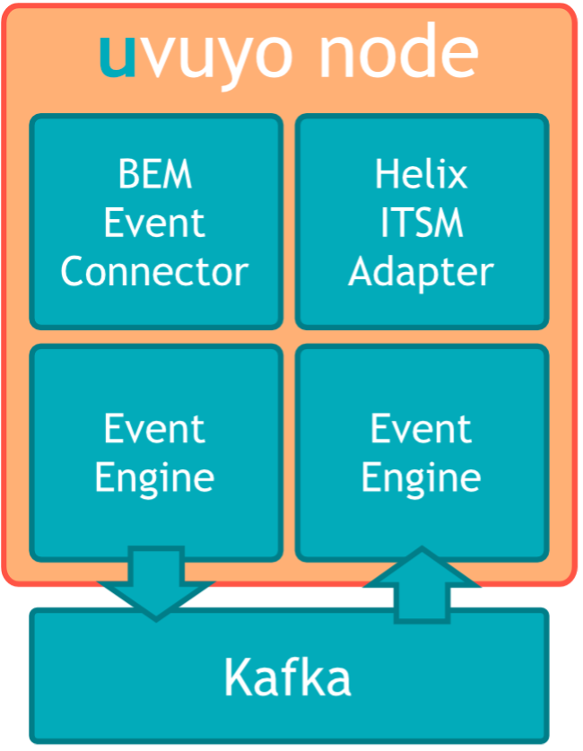
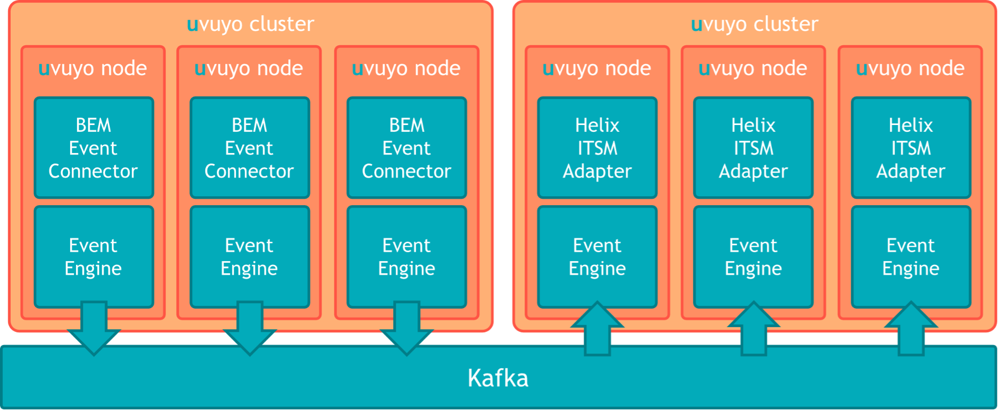
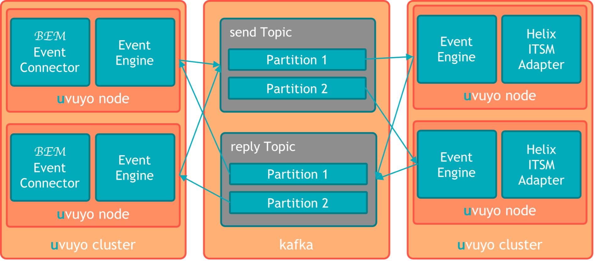

The uvuyo gateway is designed to take events from various sources and convert them to various destinations. This is done using plugins into the core system called connectors and adapters. As mentioned above connectors are used to connect event sources and adapters are used to connect event destinations.

Connectors and adapters run in uvuyo nodes. An uvuyo node can host multiple connectors /adapters or just a single connector/adapter.

The simplest uvuyo installation would look like this:

uvuyo nodes are designed to be microservices and can run either as a process on a server or within a docker container. In the Telefonica environment we going to run the node as a process on a server.

uvuyo nodes are stateless, meaning they will not store any information about the events they processed. This allows the system to scale horizontally. Since the nodes don’t store any information about the events processed, the events must carry all the event specific information, so that the events can be processed properly.

uvuyo nodes can be clustered into uvuyo clusters. An uvuyo clusters are sets of uvuyo nodes. uvuyo clusters are setup for scalability and availability reasons. If a node in a cluster fails, the other nodes are going to take over the work of the node.

The uvuyo gateway uses kafka as a messaging system to send data between the adapters. Data from a connector is send to a kafka topic and picked up by an adapter of the corresponding cluster. The topic used to send data from the connector to the adapter is called the send topic. The name of the topic is combined of a prefix (by default “net.2yetis.uvuyo”), the dispatcher Id and the constant “send”. An example for a topic name could be: “net.2yetis.uvuyo.helixITSM.send”.

The dispatcher ID is a logical ID that binds the connector and the adapter. The connector will send data to the topic with the corresponding dispatcher ID. The adapter will receive the data from the topic with the corresponding dispatcher ID.

The send topic should be configured to have the same number of partitions as the number of uvuyo nodes in the uvuyo cluster hosting the adapters.

After picking up the event from the send topic and sending it to the destination system (in case of Telefonica to the Helix ITSM system), The adapter will reply to the connector using the reply topic. The reply will contain the unique identifier created by the destination system (in case of Telefonica the Helix ITSM adapter will send a reply with the incident number of the incident created). The name of the topic is combined of a prefix (by default “net.2yetis.uvuyo”), the dispatcher Id and the constant “reply”. An example for a topic name could be: “net.2yetis.uvuyo.helixITSM.reply”.

The reply topic should be configured to have the same number of partitions as the number of uvuyo nodes in the cluster hosting the connectors.

Events from a connector are partitioned by the source of the event. Events from the same source will be processed by the adapters in the same order they arrive at a specific connector. The order of the events send by different sources to a specific adapter is likely to be processed in same order by the adapters, but the order is not guaranteed.

It is important to understand that to keep the order of events send to connectors, the events of a specific source must always be send to the same connector.

